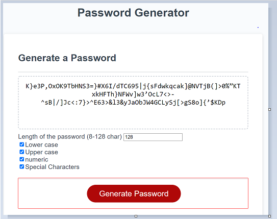

# Password Generator

Password generator is a webapp that creates a password following this criteria: It can have from 1 to 128 combinations of lowercase, uppercase, numeric, and/or special characters.

## Installation

You can use the Password Generator just by clicking this url: [https://giannifontanot.github.io/password-generator/](https://giannifontanot.github.io/password-generator/)

## Usage

1. Select the number of characters you want the password to be.
2. Select at least one of this checkboxes: Uppercase, lowercase, numbers and / or special characters.

## Contributing
Pull requests are welcome. For major changes, please open an issue first to discuss what you would like to change.

Please make sure to update tests as appropriate.

## License
[MIT](https://choosealicense.com/licenses/mit/)
